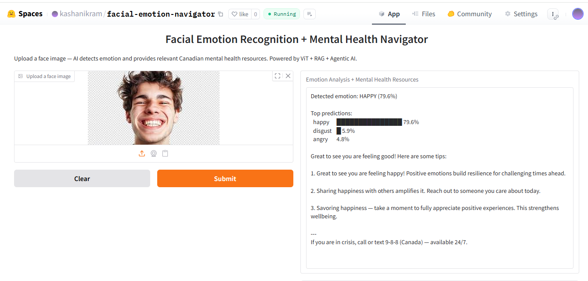

# Facial Emotion Navigator

I built this to explore whether AI can do more than just classify emotions — can it actually respond to them in a meaningful way?

Upload a face image and the system detects the emotion, then routes to the right response. Concerning emotions like sadness or fear trigger a search through real Canadian mental health resources. Positive emotions get motivational tips. Everything is grounded in actual data, not generated text.

👉 [Try the live demo](https://huggingface.co/spaces/kashanikram/facial-emotion-navigator)

## What it does

Upload any face image and get:

- Detected emotion with confidence score
- Top 3 emotion predictions with visual bars
- Relevant Canadian mental health resources (if emotion is concerning)
- Wellness tips (if emotion is positive or neutral)
- Crisis line 9-8-8 always visible
- 

## How it works

Image uploaded → ViT model detects emotion → Agentic router classifies as concerning, positive, or neutral → RAG searches emotion-specific FAISS index → Grounded response returned

- Vision model — ViT-base fine-tuned with LoRA on FER2013 dataset (28,709 face images, 7 emotions)
- RAG layer — 70 Canadian mental health resources indexed in 7 separate FAISS indexes (one per emotion)
- Agentic router — decides response type based on detected emotion and confidence score
- Resources from CAMH, Crisis Services Canada, WHO, Anxiety Canada, BounceBack Canada

## Stack

- ViT-base + LoRA (PEFT) — fine-tuned on FER2013, 65.74% accuracy (above human baseline of 65%)
- FAISS + sentence-transformers — semantic search over mental health resources
- Gradio — UI, deployed on HuggingFace Spaces
- Google Colab (T4 GPU) — used for training

## Dataset

FER2013 — 28,709 training images, 7 emotions: angry, disgust, fear, happy, neutral, sad, surprise.

Sourced from Kaggle: kaggle.com/datasets/msambare/fer2013

## Model

Fine-tuned model: [kashanikram/facial-emotion-vit](https://huggingface.co/kashanikram/facial-emotion-vit)

## Project Structure

├── app.py                          Gradio app + agentic router + RAG + emotion detection
├── requirements.txt                All dependencies
├── Notebook1_EmotionRecognition    Fine-tuning ViT with LoRA on FER2013
├── Notebook2_MentalHealth_RAG      Building FAISS indexes from mental health resources
└── Notebook3_Agent_Gradio          Agentic system + Gradio demo

## Built by

Kashan Ikram — BS Computer Science (AI specialization) @ BIMS, Pakistan
